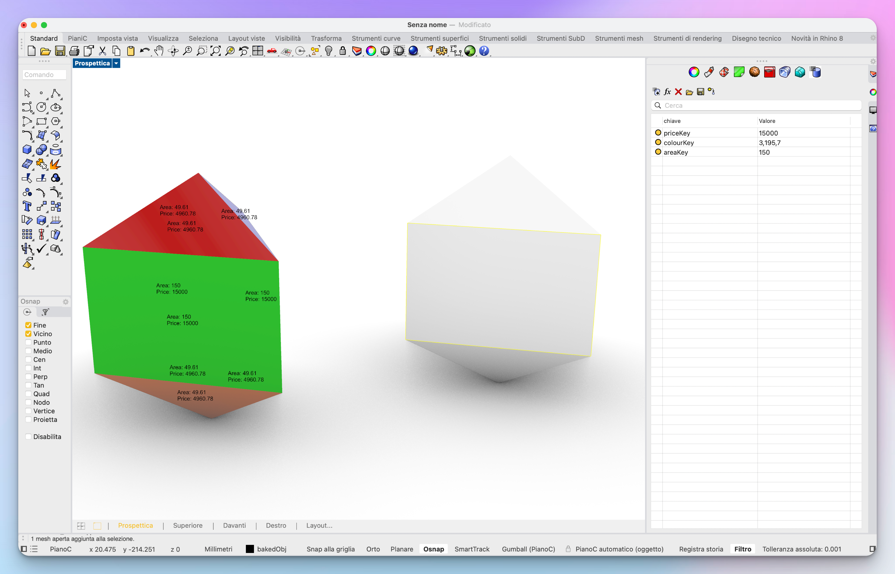
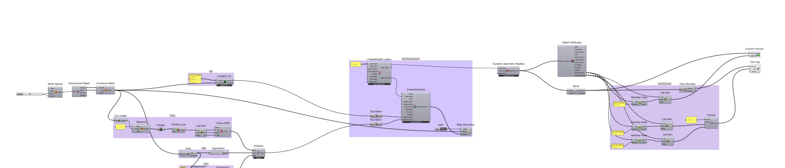

# Semantic Geometry

A Grasshopper tool to add semantic attributes to Rhino geometry using Human plugin.

## Overview

This tool allows you to add custom attributes to nested geometries in Grasshopper and bake them into Rhino. It leverages the powerful [Human plugin](https://www.food4rhino.com/en/app/human) to manage and attach semantic information to geometric elements.

## Features

- Add multiple custom attributes to geometry
- Support for nested geometry structures
- Bake functionality to transfer attributes to Rhino
- Flexible attribute management through Human plugin

## Example

*Example showing geometry faces with three custom attributes: priceKey, colourKey, and areaKey*

## Workflow

*The complete Grasshopper definition showing the semantic attribution process*

## Requirements

- Rhinoceros 3D
- Grasshopper
- [Human plugin](https://www.food4rhino.com/en/app/human)

## Usage

1. Load the Grasshopper definition
2. Connect your input geometry
3. Define custom attributes using Human components
4. Apply attributes to geometry faces
5. Bake the result to Rhino if needed

## License

This project is licensed under the GNU General Public License v3.0 (GPLv3) - see the [LICENSE](LICENSE) file for details.

The GPLv3 is a copyleft license that requires anyone who distributes your code or a derivative work to make the source available under the same terms.

## Contributing

Feel free to open issues or submit pull requests if you have suggestions for improvements.
